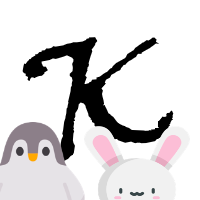

# koWloon (generic) notes

Kgn is an app with notes inside notes all the way down to more notes 📝  
First time users might want to read the [Tutorial](https://github.com/endriVV/koWloon-generic-notes/wiki/Basic-Tutorial).

# Notice:

Kgn is still in development, it might lose notes due to bugs, it is advised to backup often.

# Install and Update:

Kgn is a single Windows file exe. Head over to the release page, download the zip, extract and run.

## Build from source

Install Nim and the needed libraries: Wnim, Winim, Jsony, Puppy, Supersnappy, Nipref  
Compile koWloon.nim with flags: --app:gui --threads:on

# Demo:

https://user-images.githubusercontent.com/103033140/162613961-6c4fd77e-f117-411e-a102-15bc287f0c42.mp4

# Credits:

💕 Nim, Nim Libraries, Nim Community  
 Pets for the logo were taken from talented [xoMikasa](https://emoji.gg/user/647561486712963101) at [emoji.gg](https://emoji.gg)

# FAQ:
## Why does my Antivirus say that Kgn is virus infected?
Kgn is virus-free. It does not include any spam, adware or spyware.  
Nim executables get a lot of false positive detection, see here on [Nim forum](https://forum.nim-lang.org/t/7885)
